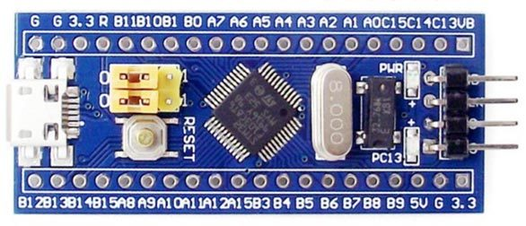

# STM32F103 Blue Pill as Universal Multi-Protocol Debug Probe

### Simple Debug Probes
### J-Link vs ST-Link vs DAP-Link vs BMP
### Introduction
There are many ways to develop for bare metal.

Among them
- J-Link (JTAG)
- ST-Link (SWD)
- DAP-Link (CMSIS-DAP)

Each requires special adapter, and most require proprietary software with multiple restrictions.
However, debugger is essential and rather simple tool.

I decided to create a compilation of available probes and list thier cons and pros implemented on a $2 STM32F103 'BluePill' board, as the most widespread and affordable hardware platform.
